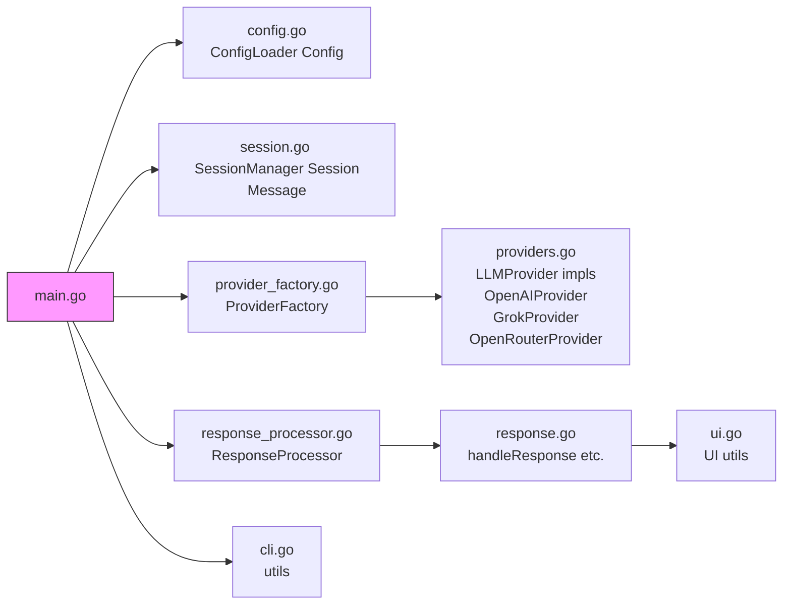

# LLM CLI Architecture Cheat Sheet

## Primitives
- **Message** ([`session.go`](session.go)): `Role string`, `Content string`, `Time time.Time` – Core chat data.
- **Session** ([`session.go`](session.go)): `Messages []Message`, `Provider string` – Conversation state.
- **Config** ([`config.go`](config.go)): API keys, models, system prompt – Flat struct for settings.

## Black Box Modules & Interfaces
| Module | File | Interface/Key Methods | Purpose |
|--------|------|-----------------------|---------|
| ConfigLoader | [`config.go`](config.go) | `NewConfigLoader().Load(path) -> *Config` | Parse ~/.llmrc INI-style. |
| SessionManager | [`session.go`](session.go) | `NewSessionManager().Load/Save/AddMessage/IsExpired/GetMessages/NewSession` | Persist/load session to ~/.llm_session.json. |
| ProviderFactory | [`provider_factory.go`](provider_factory.go) | `NewProviderFactory().Create(model, config) -> LLMProvider, queryModel` | Instantiate OpenAI/Grok/OpenRouter/lm-proxy. |
| ResponseProcessor | [`response_processor.go`](response_processor.go) | `NewDefaultResponseProcessor().Process(sessionManager, session, query, response, format)` | Delegate to response.go (print/files/commands). |
| UIHandler | [`ui.go`](ui.go) | `getVisualSeparator()`, `formatAndPrintNonCodeResponse` | Terminal rendering, spinners, colors. |
| CLI Utils | [`cli.go`](cli.go) | `expandTilde`, `replacePlaceholders` | Path/OS/shell helpers. |
| LLMProvider | [`providers.go`](providers.go) | `Query(model, messages, onChunk) string` | Streaming chat API abstraction. |

## Boundaries
- Data flows as primitives through interfaces.
- No impl leaks (e.g., file paths hidden in managers).
- Replace any module using interface (mock for tests).

## Build & CI
- `make build`: Prod binary (`-ldflags="-s -w -X main.buildTime=..."`).
- `make test`: `go test ./... -coverprofile=coverage.out` (25%+ coverage).
- `make cover`: HTML report (`/tmp/cover*.html`).

## Verification
- Tests pass (`make test`).
- Coverage: CLI/UI/Config/Session/Factory 80-100%; Providers/Response integration needed.
- Modular: main.go ~120 lines orchestration only.

## Features
- Accept command line parameters and forward them as queries to configured LLMs
- Support multiple LLM providers, leverage OpenRouter so we can select different models easily 
- Handle LLM responses in user-specified ways
- Support input from command line arguments, files, stdin, and piped input
- Handle multi-line queries and complex input formats

### Response Handling Options
- Print responses to stdout
- Format responses as:
  - Plain text
  - JSON
  - Markdown
- Extract and save LLM-generated files directly to the filesystem by default (parse code blocks in markdown format)
- Parse and execute approved commands suggested by the LLM (identified in backticks or code blocks, with explicit user confirmation required for each command)

### Configuration Management
- Store LLM credentials in a dot file (e.g., ~/.llmrc) using plain text key=value format
- Configure system prompts per session or globally
- Support multiple LLM configurations

### Session Management
- Maintain active sessions with LLMs for up to 1 day since last interaction
- Inspect session files to see full conversation, `~/.llm_session.json`
- Allow conversation continuity within session timeout
- Automatic session cleanup after timeout
- Option to start a new session manually

### Implementation
- Written in Golang
- Modular design with interface-based LLM provider abstraction for extensibility

### Supported LLMs
- OpenRouter
- OpenAI
- Grok
- lm-proxy

### Command-Line Options
- `--help`: Display help information
- `--version`: Show tool version
- `--model`: Specify LLM model to use
- `--config`: Path to configuration file
- `--system-prompt`: Override default system prompt
- `--session-timeout`: Set session timeout in minutes
- `--new-session`: Start a new session, flushing any existing session
- `--verbose`: Enable verbose output
- `--quiet`: Suppress non-essential output
- `--save-response`: Save response to specified file

## Non-Functional Requirements

### Performance
- Response times should be reasonable for LLM API calls
- Minimal memory footprint for CLI tool
- Efficient handling of large responses

### Security
- Secure storage of API credentials
- No logging of sensitive information
- HTTPS for all API communications

### Error Handling
- Graceful handling of network failures
- Clear error messages for invalid configurations
- Fallback to default settings when possible

### Platforms
- Linux (primary)
- macOS
- Windows
# LLM CLI Architecture

## Dependencies

- main orchestrates all modules.
- Providers implement LLMProvider interface.
- ResponseProcessor delegates to response handling.
- UI and CLI utils are helpers.
